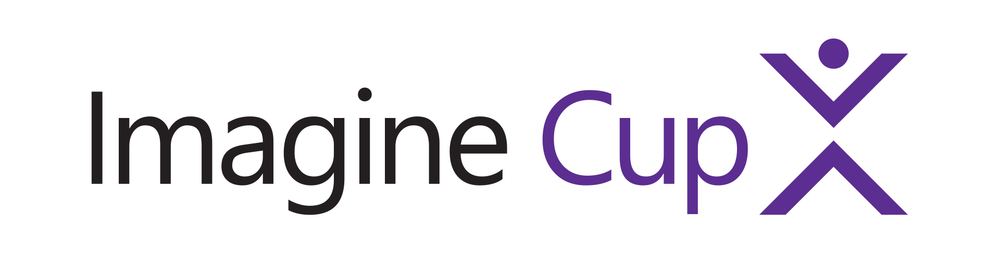

Concursos
=========

Imagine Cup
-----------

Competición global para estudiantes donde pueden que quiere ayudar a que las
próximas generaciones de profesionales colaboren y utilicen su creatividad,
pasión y conocimiento de la tecnología para crear aplicaciones que cambien
nuestra forma de vida, de trabajar y de jugar.

Los equipos son formados por uno o varios estudiantes y un mentor.

Acceso: [compete.imagine.microsoft.com](https://compete.imagine.microsoft.com/)

Apps for good
-------------

CampusMVP, con la colaboración de Microsoft, organiza este concurso de
programación de aplicaciones móviles con Xamarin.

La mecánica es muy sencilla: crea una aplicación móvil con Xamarin y Azure,
envíanosla para evaluarla, y podrás ganar 5.000€ más [un curso online de
desarrollo profesional con
Xamarin](http://www.campusmvp.es/catalogo/Product-Desarrollo-de-aplicaciones-m%C3%B3viles-nativas-multiplataforma-con-C-y-Xamarin_160.aspx) de
campusMVP. También tenemos otros 4 premios dotados de 1.000€ cada uno.

Acceso:
[www.campusmvp.es/concurso-xamarin.htm](http://www.campusmvp.es/concurso-xamarin.htm)
